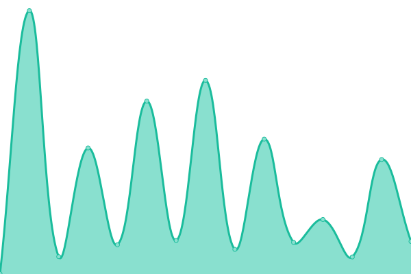
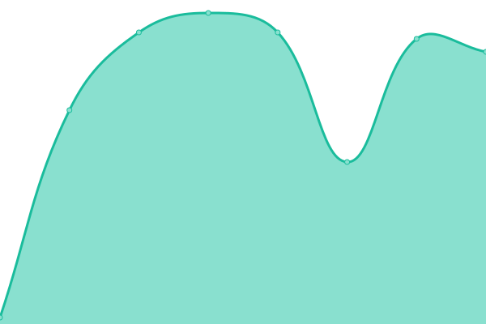

# [📈 Live Status](https://demo.upptime.js.org): <!--live status--> **🟧 Partial outage**

This repository contains the open-source uptime monitor and status page for [zhanxw](http://zhanxw.com), powered by [Upptime](https://github.com/upptime/upptime).

With [Upptime](https://upptime.js.org), you can get your own unlimited and free uptime monitor and status page, powered entirely by a GitHub repository. We use [Issues](https://github.com/zhanxw/upptime/issues) as incident reports, [Actions](https://github.com/zhanxw/upptime/actions) as uptime monitors, and [Pages](https://demo.upptime.js.org) for the status page.

<!--start: status pages-->
<!-- This summary is generated by Upptime (https://github.com/upptime/upptime) -->
<!-- Do not edit this manually, your changes will be overwritten -->
<!-- prettier-ignore -->
| URL | Status | History | Response Time | Uptime |
| --- | ------ | ------- | ------------- | ------ |
|  [zhanxw main site](https://zhanxw.com) | 🟩 Up | [zhanxw-main-site.yml](https://github.com/zhanxw/upptime/commits/HEAD/history/zhanxw-main-site.yml) | 

 199ms
     
 | 

<a href="https://zhanxw.github.io/upptime/history/zhanxw-main-site">100.00%</a>
    

|  [Omics Rocks](https://omics.rocks) | 🟩 Up | [omics-rocks.yml](https://github.com/zhanxw/upptime/commits/HEAD/history/omics-rocks.yml) | 

 261ms
     
 | 

<a href="https://zhanxw.github.io/upptime/history/omics-rocks">100.00%</a>
    

|  [gene work](https://gene.work) | 🟩 Up | [gene-work.yml](https://github.com/zhanxw/upptime/commits/HEAD/history/gene-work.yml) | 

 131ms
     
 | 

<a href="https://zhanxw.github.io/upptime/history/gene-work">100.00%</a>
    

|  [IsoAnalytics](https://cdc.biohpc.swmed.edu/isoplexis/) | 🟩 Up | [iso-analytics.yml](https://github.com/zhanxw/upptime/commits/HEAD/history/iso-analytics.yml) | 

 466ms
     
 | 

<a href="https://zhanxw.github.io/upptime/history/iso-analytics">0.00%</a>
    

|  [ScopeViewer](https://cdc.biohpc.swmed.edu/scopeviewer/) | 🟩 Up | [scope-viewer.yml](https://github.com/zhanxw/upptime/commits/HEAD/history/scope-viewer.yml) | 

 35ms
     
 | 

<a href="https://zhanxw.github.io/upptime/history/scope-viewer">100.00%</a>
    

|  [QBRC main site](https://qbrc.swmed.edu) | 🟩 Up | [qbrc-main-site.yml](https://github.com/zhanxw/upptime/commits/HEAD/history/qbrc-main-site.yml) | 

 332ms
     
 | 

<a href="https://zhanxw.github.io/upptime/history/qbrc-main-site">100.00%</a>
    

|  [VAMPr VAriant Mapping and Prediction of antimicrobial resistance](https://cdc.biohpc.swmed.edu/VAMPr/VAMPr.cgi) | 🟩 Up | [vam-pr-v-ariant-mapping-and-prediction-of-antimicrobial-resistance.yml](https://github.com/zhanxw/upptime/commits/HEAD/history/vam-pr-v-ariant-mapping-and-prediction-of-antimicrobial-resistance.yml) | 

 191ms
     
 | 

<a href="https://zhanxw.github.io/upptime/history/vam-pr-v-ariant-mapping-and-prediction-of-antimicrobial-resistance">100.00%</a>
    

|  [Omics Rocks](https://omics.rocks) | 🟩 Up | [omics-rocks.yml](https://github.com/zhanxw/upptime/commits/HEAD/history/omics-rocks.yml) | 

 261ms
     
 | 

<a href="https://zhanxw.github.io/upptime/history/omics-rocks">100.00%</a>
    

|  [MB.LRP](https://cdc.biohpc.swmed.edu/mblrp/) | 🟥 Down | [mb-lrp.yml](https://github.com/zhanxw/upptime/commits/HEAD/history/mb-lrp.yml) | 

 36ms
     
 | 

<a href="https://zhanxw.github.io/upptime/history/mb-lrp">0.00%</a>
    

<!--end: status pages-->

[**Visit our status website →**](https://demo.upptime.js.org)

## 📄 License

- Powered by: [Upptime](https://github.com/upptime/upptime)
- Code: [MIT](./LICENSE) © [zhanxw](http://zhanxw.com)
- Data in the `./history` directory: [Open Database License](https://opendatacommons.org/licenses/odbl/1-0/)
